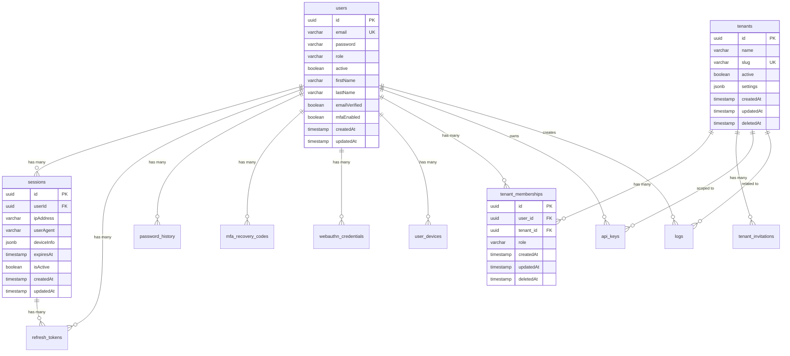

# AuthCakes API Current Database Schema Analysis

## Executive Summary

The current AuthCakes API database consists of 13 primary tables built on PostgreSQL with TypeORM. The schema is focused on authentication, multi-tenancy, and user management with strong security features including MFA, session management, and comprehensive audit trails.

**Key Statistics:**
- **Total Tables**: 13
- **Total Columns**: ~180
- **Primary Focus**: Authentication & Multi-tenancy
- **Database**: PostgreSQL with pgcrypto extension
- **ORM**: TypeORM

## Database Architecture

### Core Design Principles

1. **UUID Primary Keys**: All tables use UUID v4 for primary keys
2. **Audit Trails**: All tables include `createdAt` and `updatedAt` timestamps
3. **Soft Deletes**: Implemented on tenant-related tables
4. **Security by Design**: Sensitive fields are excluded from API responses
5. **JSONB Flexibility**: Used for settings, metadata, and extensible fields

### Module Organization

```
├── Users Module (1 table)
│   └── users
├── Authentication Module (6 tables)
│   ├── sessions
│   ├── refresh_tokens
│   ├── password_history
│   ├── mfa_recovery_codes
│   ├── webauthn_credentials
│   └── user_devices
├── Tenants Module (3 tables)
│   ├── tenants
│   ├── tenant_memberships
│   └── tenant_invitations
├── API Module (1 table)
│   └── api_keys
├── Logs Module (1 table)
│   └── logs
└── Settings Module (1 table)
    └── system_settings
```

## Entity Relationship Diagram



## Detailed Table Analysis

### 1. Users Table

**Purpose**: Core user account storage with authentication and profile data

**Key Features**:
- Comprehensive user profile fields (30+ columns)
- Built-in support for MFA (TOTP)
- Email and phone verification
- Account recovery mechanisms
- Failed login tracking and account locking
- Password reset functionality

**Security Considerations**:
- 15 fields marked as excluded from API responses
- Password hashing (bcrypt)
- Token-based verification and recovery

**Relationships**:
- Central entity with 9 related tables
- One-to-many with all auth-related tables

### 2. Sessions Table

**Purpose**: Active session tracking with device fingerprinting

**Key Features**:
- Device information storage (JSONB)
- Session revocation support
- Activity tracking
- Expiration management

**Indexes**: 4 indexes for performance
- userId, expiresAt, isActive, revoked

**Check Constraints**:
- Ensures expiration after creation
- Validates revocation consistency

### 3. Refresh Tokens Table

**Purpose**: JWT refresh token lifecycle management

**Key Features**:
- Token rotation support (replacedByToken)
- Revocation with reason tracking
- Session association
- Device/IP tracking

**Security**:
- Unique token constraint
- Expiration validation
- Revocation audit trail

### 4. Tenants Table

**Purpose**: Multi-tenant organization management

**Key Features**:
- Slug-based routing
- Soft delete support
- Flexible settings storage (JSONB)
- Logo/branding support

**Usage Pattern**:
- Central to multi-tenancy
- Isolated data per tenant
- Role-based access within tenants

### 5. Tenant Memberships Table

**Purpose**: User-tenant associations with roles

**Key Features**:
- Role-based access control
- Soft delete for membership removal
- Audit trail for changes

**Database Design**:
- Snake_case column naming (legacy)
- Foreign key constraints to users and tenants

### 6. API Keys Table

**Purpose**: Programmatic API access management

**Key Features**:
- User and tenant scoping
- Permission system (JSONB)
- Expiration support
- Active/inactive states

**Use Cases**:
- Service-to-service authentication
- CI/CD integrations
- Third-party access

### 7. Logs Table

**Purpose**: Comprehensive audit trail and activity logging

**Key Features**:
- User and tenant context
- Flexible detail storage (JSONB)
- IP and user agent tracking
- Indexed for performance

**Design**:
- Nullable foreign keys for system events
- Timestamp indexing for queries

### 8. System Settings Table

**Purpose**: Key-value configuration storage

**Key Features**:
- Type hints for values
- Description field for documentation
- Simple key-based access

**Use Cases**:
- Feature flags
- System configuration
- Runtime settings

## Database Patterns & Best Practices

### 1. Security Patterns

```typescript
// Excluded sensitive fields
@Exclude()
password: string;

@Exclude()
mfaSecret: string;

@Exclude()
resetToken: string;
```

### 2. Soft Delete Pattern

```typescript
@DeleteDateColumn()
deletedAt: Date;
```

### 3. Audit Pattern

```typescript
@CreateDateColumn()
createdAt: Date;

@UpdateDateColumn()
updatedAt: Date;
```

### 4. Index Strategy

- Foreign key indexes for join performance
- Composite indexes for common queries
- Unique constraints for business rules

## Migration Considerations

### Current Schema Strengths
1. Well-structured authentication system
2. Comprehensive session management
3. Multi-tenancy foundation
4. Security-first design
5. Audit trail implementation

### Current Schema Limitations
1. Simple role system (user/admin only)
2. No organization hierarchy
3. Limited licensing/subscription support
4. No internationalization
5. Basic settings management

### Data Volume Estimates

Based on typical usage patterns:

| Table | Estimated Rows | Growth Rate |
|-------|----------------|-------------|
| users | 10,000-100,000 | Linear |
| sessions | 50,000-500,000 | High churn |
| refresh_tokens | 100,000-1M | High churn |
| tenant_memberships | 20,000-200,000 | Linear |
| logs | 1M-10M | Continuous |

## Performance Optimization

### Current Indexes

1. **Primary Indexes**: All UUID primary keys
2. **Foreign Key Indexes**: All relationships indexed
3. **Business Indexes**: Email, tokens, slugs
4. **Performance Indexes**: Timestamps, status flags

### Query Patterns

Common query patterns identified:
1. User authentication lookups
2. Session validation queries
3. Tenant membership checks
4. Token refresh operations
5. Audit log searches

## Security Analysis

### Strengths
1. Comprehensive password management
2. MFA implementation
3. Session security with revocation
4. Token rotation
5. Failed login protection
6. Device tracking

### Areas for Enhancement
1. Field-level encryption for PII
2. More granular permissions
3. IP allowlisting
4. Advanced threat detection

## Recommendations for Migration

### High Priority
1. Preserve all user authentication data
2. Maintain session continuity
3. Map roles to new privilege system
4. Retain audit trails

### Medium Priority
1. Enhance tenant structure to organizations
2. Implement modular permissions
3. Add licensing capabilities

### Low Priority
1. Optimize data types
2. Standardize naming conventions
3. Add missing indexes

## Conclusion

The current AuthCakes database schema provides a solid foundation for authentication and multi-tenancy. The migration to the master schema will enhance capabilities while preserving core functionality. Key focus areas should be:

1. Data integrity during migration
2. Zero downtime deployment
3. Backward compatibility
4. Performance optimization
5. Security enhancement

This analysis serves as the baseline for planning the migration to the 48-table master schema, ensuring all current functionality is preserved while enabling new enterprise features.