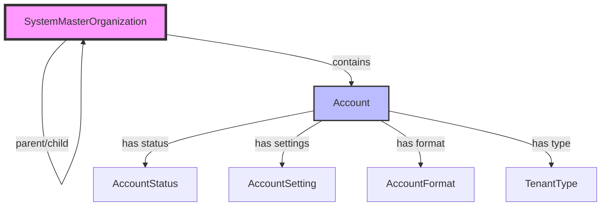
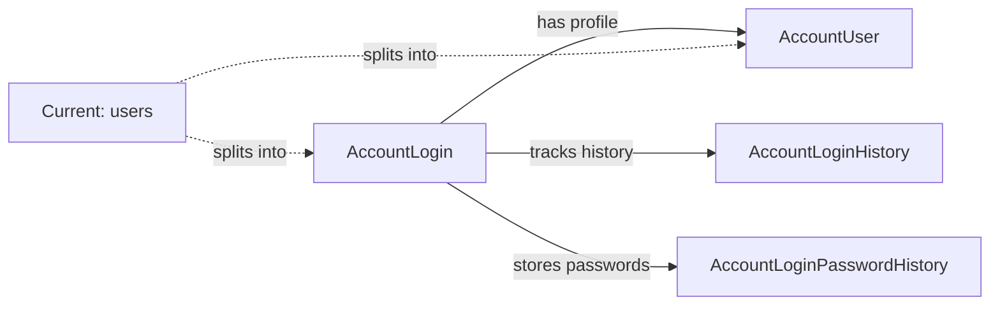
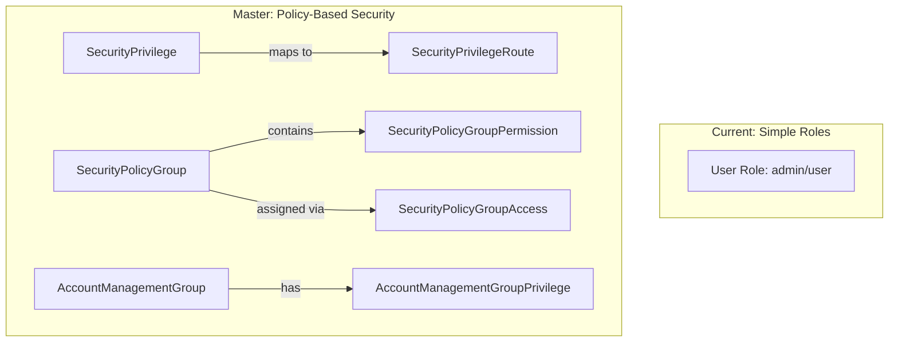
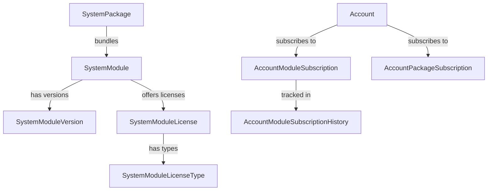

# Master Database Schema Analysis

## Executive Summary

The master database schema represents a comprehensive enterprise SaaS platform architecture with 48 tables compared to the current 13 tables. It introduces advanced features including modular licensing, hierarchical organizations, policy-based security, and full internationalization support.

**Key Enhancements:**
- **4x More Tables**: 48 vs 13 tables
- **Modular Architecture**: Feature-based licensing system
- **Enterprise Security**: Policy-based access control
- **Multi-tenancy**: Hierarchical organization support
- **Global Ready**: Full internationalization
- **Audit Complete**: Comprehensive tracking on all entities

## Schema Comparison Overview

| Feature Area | Current Schema | Master Schema | Enhancement Factor |
|--------------|----------------|---------------|-------------------|
| Tables | 13 | 48 | 3.7x |
| Authentication | Basic (1 table) | Advanced (4 tables) | 4x |
| Multi-tenancy | Simple (3 tables) | Enterprise (6 tables) | 2x |
| Security | Role-based (1 dimension) | Policy-based (8 tables) | 8x |
| Licensing | None | Modular (8 tables) | New |
| Internationalization | None | Complete (5 tables) | New |
| Organization Hierarchy | None | Multi-level (3 tables) | New |

## Functional Architecture

### 1. Account & Organization Management



**Current → Master Evolution:**
- `tenants` → `accounts` with enhanced features:
  - Status-based lifecycle management
  - Per-account database connections
  - Theme and branding customization
  - Account type categorization
  - Hierarchical organization support

**New Capabilities:**
- Multi-level organization hierarchies
- Partner/reseller management
- White-label support
- Account lifecycle automation

### 2. Authentication Architecture



**Key Architectural Change:**
The master schema **separates authentication from user profiles**:
- `AccountLogin`: Credentials, auth settings, security flags
- `AccountUser`: Profile data, preferences, contact info

**Benefits:**
- Multiple auth providers per user
- Separate security from profile updates
- Better GDPR compliance (data separation)
- Enhanced security monitoring

### 3. Security Model Evolution



**Security Transformation:**
- **Current**: Binary role system (user/admin)
- **Master**: Granular policy-based system
  - 100+ individual privileges
  - Route-level permissions
  - Policy grouping and inheritance
  - Account-specific groups

### 4. Licensing & Subscription System



**New Feature Set:**
- Modular feature licensing
- Version-specific subscriptions
- Usage-based pricing support
- Package bundles
- Subscription history tracking
- License count enforcement

### 5. Data Model Mapping

#### User Migration Path
```sql
-- Current: Single users table
users {
    id, email, password, firstName, lastName, 
    role, mfaEnabled, emailVerified, ...
}

-- Master: Split into two tables
account_logins {
    id, email, password_hash, 
    is_locked, failed_login_attempts, 
    mfa_enabled, ...
}

account_users {
    id, account_login_id, first_name, 
    last_name, avatar_url, bio, ...
}
```

#### Tenant Migration Path
```sql
-- Current: Simple tenants
tenants {
    id, name, slug, logo, active, settings
}

-- Master: Rich accounts
accounts {
    id, name, subdomain, logo_url,
    account_status_id, account_type_id,
    database_connection_string,
    theme_primary_color, ...
}
```

#### Membership Migration Path
```sql
-- Current: Direct user-tenant membership
tenant_memberships {
    user_id, tenant_id, role
}

-- Master: Group-based membership
account_management_groups {
    id, account_id, name, is_system
}
account_management_group_members {
    group_id, account_user_id
}
account_management_group_privileges {
    group_id, security_privilege_id
}
```

### 6. New Feature Capabilities

#### A. Internationalization Support
- **SystemCountry**: 250+ countries with ISO codes
- **SystemCulture**: Language/locale combinations
- **SystemTimeZone**: IANA timezone database
- **SystemLocalization**: Translatable content

#### B. Dynamic Configuration
- **SystemCommonList/Items**: Configurable dropdowns
- **SystemSettings**: Global configuration
- **AccountSettings**: Per-account overrides
- **SystemAnnouncements**: Broadcast messaging

#### C. Enhanced Contact Management
- Multiple addresses per entity
- Multiple phone numbers with types
- Address type categorization
- International address formats

#### D. Comprehensive Auditing
Every table includes:
```typescript
date_created: timestamp
date_modified: timestamp
created_by: uuid
modified_by: uuid
is_deleted: boolean
deleted_by: uuid
date_deleted: timestamp
```

### 7. Migration Complexity Analysis

#### High Complexity Migrations
1. **User Split**: Separating authentication from profiles
2. **Role → Policy**: Converting simple roles to policy-based security
3. **Tenant → Account**: Adding required fields and relationships

#### Medium Complexity Migrations
1. **API Keys**: Adding usage tracking and rate limiting
2. **Sessions**: Converting to login history
3. **Settings**: Splitting global vs account-specific

#### Low Complexity Migrations
1. **Logs**: Direct field mapping
2. **MFA/WebAuthn**: Similar structure
3. **Password History**: Compatible design

### 8. Feature Comparison Matrix

| Feature | Current | Master | Migration Impact |
|---------|---------|---------|-----------------|
| User Management | Single table | Split tables | High - Data transformation |
| Authentication | Basic JWT | Multi-provider | Medium - Add providers |
| Multi-tenancy | Flat structure | Hierarchical | High - Add hierarchy |
| Permissions | Role-based | Policy-based | High - Complete redesign |
| API Keys | Basic | Usage tracked | Low - Add fields |
| Licensing | None | Comprehensive | New - No migration |
| I18n | None | Full support | New - No migration |
| Audit Trail | Partial | Complete | Medium - Add fields |
| Settings | Key-value | Structured | Low - Compatible |

### 9. Technical Advantages

#### Performance
- Optimized indexes on all foreign keys
- Separate read/write models possible
- Partition-ready design
- Cache-friendly structure

#### Security
- Separated authentication concerns
- Policy-based access control
- Complete audit trails
- Soft delete for compliance

#### Scalability
- Multi-database architecture
- Modular feature deployment
- Hierarchical data isolation
- Event-sourcing ready

#### Maintainability
- Clear separation of concerns
- Consistent naming conventions
- Comprehensive documentation
- Version tracking

### 10. Implementation Priorities

#### Phase 1: Core Migration (Required)
1. User authentication split
2. Tenant to account conversion
3. Basic security policy setup
4. API compatibility layer

#### Phase 2: Enhanced Features (High Value)
1. Licensing system activation
2. Organization hierarchy
3. Advanced security policies
4. Internationalization

#### Phase 3: Advanced Capabilities (Future)
1. Multi-database routing
2. Advanced analytics
3. Custom module development
4. White-label features

## Conclusion

The master database schema represents a significant architectural upgrade that transforms AuthCakes from a basic authentication system into a comprehensive enterprise SaaS platform. While the migration complexity is substantial, the benefits include:

1. **Enterprise Readiness**: Support for complex organizational structures
2. **Revenue Enablement**: Built-in licensing and subscription management
3. **Global Scale**: Full internationalization support
4. **Security Excellence**: Policy-based access control
5. **Future Proof**: Modular architecture for feature expansion

The migration should be approached in phases, with careful attention to data integrity and backward compatibility during the transition period.